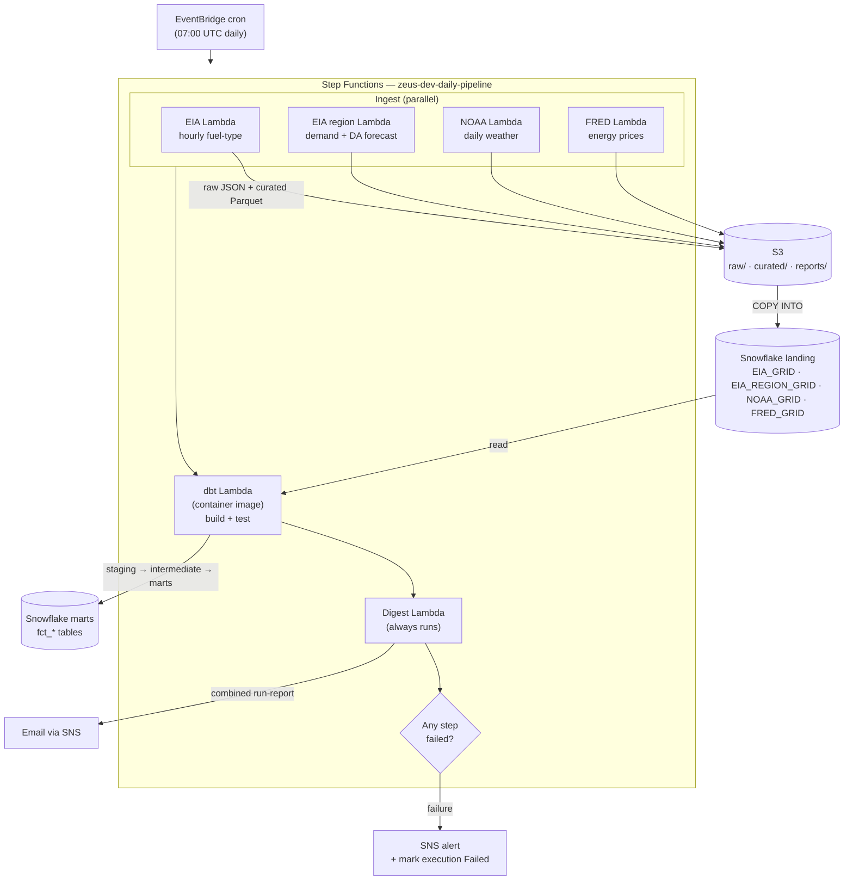
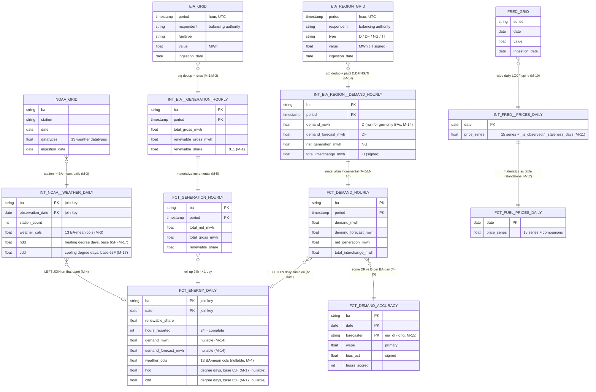
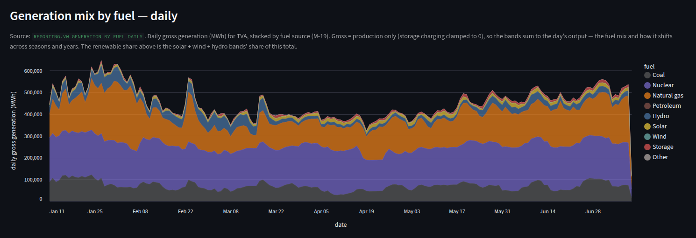
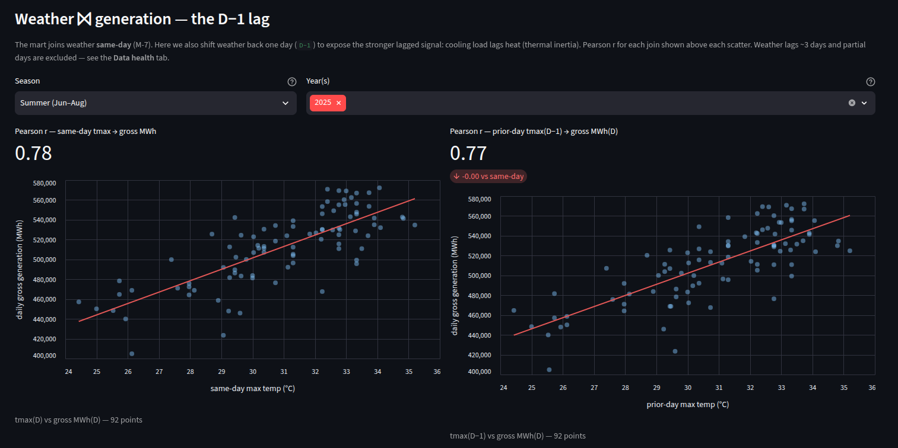
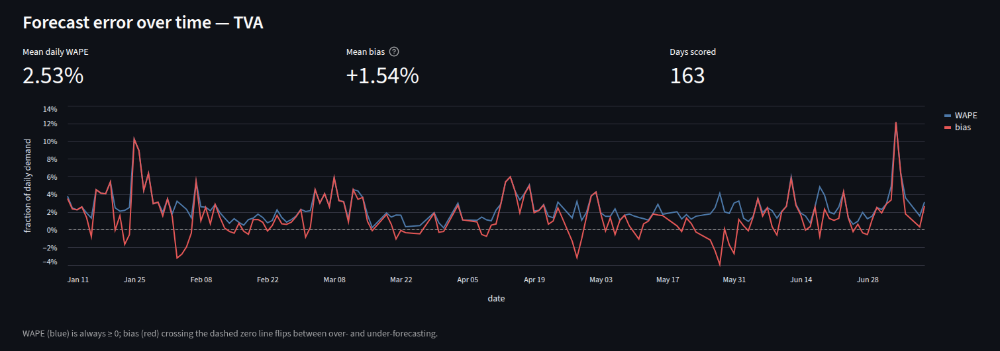

# Zeus

A serverless **energy-data platform** on AWS + Snowflake. One Step Functions state machine runs the whole daily flow: four ingestion pipelines — **EIA** (hourly fuel-type generation), **EIA region** (hourly demand, day-ahead demand forecast, net generation, and interchange per balancing authority), **NOAA** (daily weather summaries), and **FRED** (national energy prices) — run in parallel, each landing raw JSON + a curated Parquet in S3 and `COPY`ing it into a Snowflake landing table; a **dbt** container-image Lambda then builds and tests the modeled layers (staging → intermediate → marts); finally a **digest** Lambda emails one combined run-report across all sources plus the dbt run. The digest always runs, even when an upstream step fails.

**Live dashboard: [zeusapplication.streamlit.app](https://zeusapplication.streamlit.app)** — the platform's serving layer, read straight from the `REPORTING` views ([screenshots below](#dashboard)).

EIA and NOAA are deliberately keyed on the same balancing-authority codes (`ba`) so weather joins to generation in the marts; FRED prices are national and land as a standalone mart (a consumer can join them on `date`).

> **Where things live:** architecture decisions → [ADR.md](ADR.md) · modeling decisions → [transform/DECISIONS.md](transform/DECISIONS.md) · operational commands & per-pipeline detail → [RUNBOOK.md](RUNBOOK.md) · conventions for *changing* the platform → [CLAUDE.md](CLAUDE.md).

## Architecture


<sub>Diagram-as-code — regenerate with `uv run --with diagrams --no-project python docs/architecture.py` (source: [`docs/architecture.py`](docs/architecture.py)). The inline Mermaid version below renders directly on GitHub and is the one to edit for quick changes.</sub>

<details>
<summary>Mermaid version (inline)</summary>



</details>

### Build & deploy

How code ships (distinct from the runtime view above). dbt/transform PRs are first validated by a **zero-copy clone CI** — build against a throwaway `CLONE` of `ZEUS_DEV`, then drop it, so prod is never touched ([ADR #15](ADR.md#15-pr-time-dbt-validation-build-against-a-zero-copy-clone-of-zeus_dev)). On merge to dev the dbt Lambda ships as a container image via GitHub Actions CD (OIDC — no long-lived keys), gated by a smoke-invoke ([ADR #16](ADR.md#16-dbt-image-cd-deploy-decoupled-from-terraform-github-oidc)). The ingest/digest Lambdas build locally as zips uploaded to S3.


<sub>Diagram-as-code — regenerate with `uv run --with diagrams --no-project python docs/deploy.py` (source: [`docs/deploy.py`](docs/deploy.py)).</sub>

### Data model

Lineage + join keys for the dbt layer, shown `landing → intermediate → marts` (the `stg_*` views are pure 1:1 dedup+rename and omitted here — see `dbt docs serve` for the full model-by-model lineage with column docs). The cross-source joins in the pipeline live inside `fct_energy_daily`, both LEFT on `(ba, date)`: EIA generation ↔ NOAA weather (M-4) and ↔ EIA-region demand (M-14) — the sources are deliberately keyed on the same balancing-authority code so these joins work. `fct_demand_accuracy` scores the operators' day-ahead forecast against actual demand per BA-day, long on a `forecaster` dimension (M-15). `fct_fuel_prices_daily` (FRED) is **standalone** — national (no `ba`), not joined to the other marts; a consumer *can* join it to `fct_energy_daily` on `date`, but the pipeline doesn't (M-12). Grains are the `PK` columns.



## Dashboard

The serving layer in action — **[zeusapplication.streamlit.app](https://zeusapplication.streamlit.app)**: a read-only Streamlit app ([`dashboard/`](dashboard/)) over the `REPORTING` views, connecting as a least-privilege role on a resource-monitor-capped warehouse ([ADR #17](ADR.md#17-public-dashboard-a-governed-read-only-serving-layer-reporting-views--leaf-role--capped-warehouse)).



<sub>**Generation** — daily gross generation stacked by fuel source (M-19); the 16 raw EIA-930 fuel codes grouped into recognizable buckets, colors pinned per fuel.</sub>



<sub>**Weather ⨝ generation** — same-day vs. prior-day max temperature against gross generation, Pearson r on each join (M-7): the thermal-inertia lag, visible.</sub>



<sub>**Operators** — the operator's own day-ahead demand forecast scored against actual demand per BA-day: daily WAPE and signed bias (M-15).</sub>

## Tech stack

| Concern | Choice |
|---|---|
| Language | Python 3.12, managed with `uv` |
| Infrastructure | Terraform (decoupled multi-state roots) |
| Compute | AWS Lambda — zip (ingest/digest) + container image (dbt) |
| Orchestration | AWS Step Functions + EventBridge cron |
| Storage | S3 (raw / curated / reports), Snowflake (landing + dbt models) |
| Transform | dbt (`dbt-snowflake`), staging → intermediate → marts |
| Alerting | SNS (one daily digest email + failure alerts) |
| Testing | pytest — offline Lambda unit suite (in-memory fakes for S3/SSM/Snowflake) |
| CI/CD | GitHub Actions — offline gates, zero-copy clone CI, OIDC image CD |

## Project status

- **Ingestion (live):** EIA (71 balancing authorities), EIA region-data (same 71 BAs — hourly demand, day-ahead demand forecast, net generation, interchange; shares the EIA API key), NOAA (14 BAs → weather stations), FRED (15 national price series). Each daily, fault-tolerant per unit.
- **Modeling (live):** dbt — **21 models** (4 staging + 5 intermediate + 6 marts + 6 reporting views), **103 tests**. Includes the demand/forecast-accuracy layer over region-data (`fct_demand_hourly`, `fct_demand_accuracy` — WAPE/bias per BA-day) base-65°F degree days (`hdd`/`cdd`) on `fct_energy_daily`, and a warn-severity energy-balance test (`D = NG − TI` per BA-day — it surfaces real EIA-930 reporting gaps, see M-18); interchange analytics come next.
- **Orchestration (live):** one Step Functions state machine on a 07:00 UTC daily cron; the digest always runs, any failure alerts via SNS and marks the execution Failed.
- **CI/CD (live):** offline gates (gitleaks + `dbt parse` + an offline Lambda unit suite (`pytest`) + `terraform fmt/validate`), a zero-copy clone CI for dbt PRs, and a decoupled dbt-image CD via GitHub OIDC.
- **Serving (live):** a `REPORTING` schema of read-only views over the marts, read by a public Streamlit dashboard ([zeusapplication.streamlit.app](https://zeusapplication.streamlit.app), source in [`dashboard/`](dashboard/)) as a least-privilege role (`ZEUS_DEV_DASHBOARD`) on a resource-monitor-capped warehouse — the governed public surface ([ADR #17](ADR.md#17-public-dashboard-a-governed-read-only-serving-layer-reporting-views--leaf-role--capped-warehouse)). Five tabs, including the **Operators** forecast-accuracy league (WAPE/bias per BA).
- **History:** EIA 2017→, NOAA 2010→, FRED 2014→ backfilled; EIA region-data backfilled 2019→ (the API route's full availability — its `startPeriod` is 2019-01-01).

## Repository layout

```
infra/        # Terraform: core (shared) + per-pipeline roots + orchestration + cicd; two shared modules
src/
  shared/     # importable by every Lambda (paths, s3_io, ssm, sns, snowflake_io, time_window, report, ingest)
  lambdas/    # eia/noaa/fred ingest + digest + dbt runner (container image)
transform/    # dbt project (staging + intermediate + marts, tests, profiles.yml)
backfill/     # one-off historical backfill scripts per source
docs/         # architecture / deploy diagrams (diagram-as-code)
.github/      # CI/CD workflows
```

The full annotated tree, with what every file owns, is in [CLAUDE.md](CLAUDE.md).

## Running it

Full commands (Terraform apply order, SSM secret setup, smoke tests, backfills) are in [RUNBOOK.md](RUNBOOK.md). In short:

```bash
uv sync --group dev                      # Python deps + dev tooling

# Terraform apply order: core → pipeline roots → orchestration LAST
cd infra/core && terraform apply         # shared S3 + SNS + Snowflake warehouse/db + landing stacks
# then each infra/pipelines/<eia|noaa|fred|digest|dbt> root, then:
cd infra/pipelines/orchestration && terraform apply

# Run the whole daily pipeline end-to-end (what the cron does)
aws stepfunctions start-execution \
  --state-machine-arn "$(terraform output -raw state_machine_arn)" --input '{}'
```

Secrets are never in code or state: each loader's public key is in Terraform; private keys and API keys live in SSM `SecureString` (see RUNBOOK for the `put-parameter` steps).

## Key architecture decisions

Highlights — the full set (18 cross-cutting + per-pipeline) is in [ADR.md](ADR.md).

- **[One fault-tolerant Step Functions state machine](ADR.md#14-daily-orchestration-one-step-functions-state-machine-over-the-pipeline-lambdas)** — parallel ingest → dbt → digest, with per-branch catches so the digest always runs and any failure alerts (#14).
- **[dbt-core in a container Lambda, not dbt Cloud](ADR.md#dbt-1-runner-a-container-image-lambda)** — one orchestration model, no vendor lock-in; includes the [`/dev/shm` multiprocessing workaround](ADR.md#dbt-3-lambda-runtime-detour-worth-recording-no-devshm) (DBT-1, DBT-3).
- **[Zero-copy clone CI for dbt PRs](ADR.md#15-pr-time-dbt-validation-build-against-a-zero-copy-clone-of-zeus_dev)** — every PR builds against a fresh `CLONE` of the warehouse, so prod is never touched (#15).
- **[Decoupled image CD via GitHub OIDC](ADR.md#16-dbt-image-cd-deploy-decoupled-from-terraform-github-oidc)** — no long-lived AWS keys; Terraform owns the infra, CI owns the image (#16).
- **[Decoupled Terraform state roots](ADR.md#2-terraform-structure-decoupled-multi-state-roots--a-shared-packaging-module)** — a broken pipeline apply can't touch shared infra (#2).
